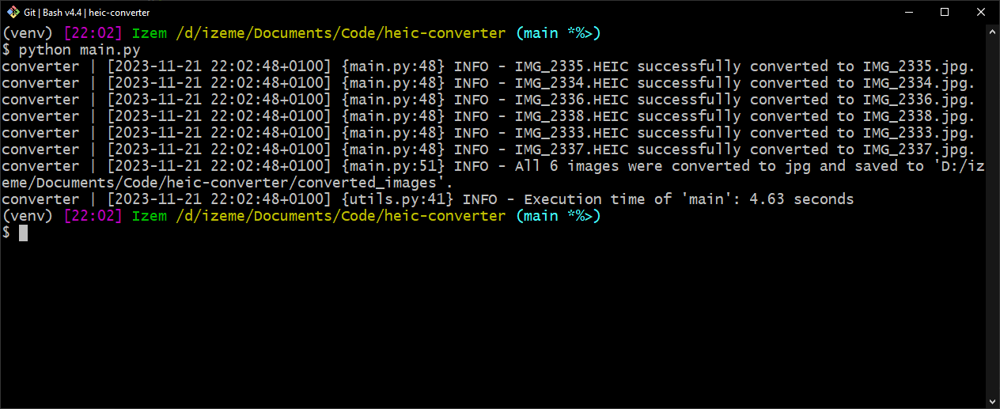

# HEIC converter
> Converting HEIC images to usable JPG images

This programs uses ImageMagick and the Wand library to convert HEIC images (coming from iPhone) to usable JPG images.

## Installation
1. You first need to install **ImageMagick** on your machine. Depending on your OS, the installation may not be the same.
Follow the installation instructions here: https://docs.wand-py.org/en/latest/guide/install.html
2. Create a virtual environment `python -m venv venv`
3. Activate the virtual environment `source venv/bin/activate` (MacOS/Linux) or `venv/Scripts/activate` (Windows)
4. Install the Wand library and the other requirements `pip install -r requirements.txt`

## Usage
1. Create a folder `heic_images/` at the root (for example "~/Documents/heic-converter/heic_images/") and put the .heic files to be converted in it.
2. Run the program: `python main.py`
